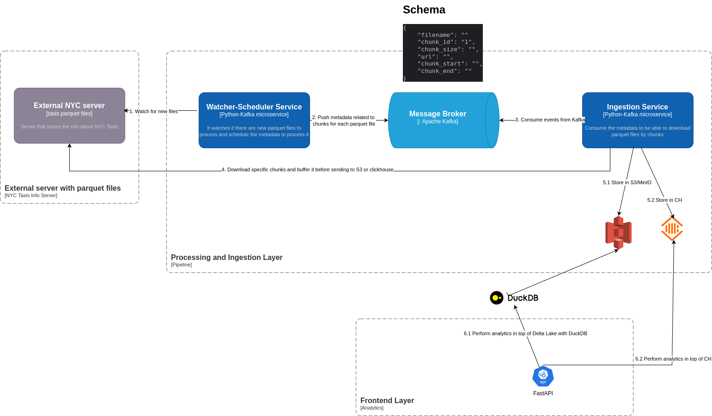

# NYC “Yellow Taxi” Trips Data - Streaming

## Questions

You have assumed the process is batch, based on the frequency of the updates. Imagine that now, you have all those files in an S3 bucket. 
New files arrive continuously with the new data and you should be able to use that new information in your process. 
How would you do that? Assume that you need to provide a rest API to expose the result for the p90 and filter by tpep_pickup_datetime, 
and that you will have hundreds of requests at the same time. 

### How would you implement the solution for this? 

Based on the requirements I would go for a Kappa Architecture using stream processing. I would use a real-time ingestion service like 
Kafka and implement a polling mechanism that would fetch and stream the data into Kafka. 
I would create a Kafka topic with "compact" cleanup policy, where the key would be the combination of the filename and the chunk_id.
The idea is to store in this topic the metadata associated to each chunk for a specific parquet file, so consumers would be able to consume this metadata 
and download the different parquet files in parallel by chunks. Let's take a closer look at the proposal:



For the ingestion process I would propose two different microservices:

1. Watcher-Scheduler service. It will be checking if there are new parquet files in the external server. It will calculate the different chunks for the
different parquet files and generating an event per chunk where the id of the event would be the combinations of the "filename" and "chunk_id". The events would
look something like this:

```
key: filename + chunk_id

value: {
    "filename": ""
    "chunk_id": "1",
    "chunk_size": "",
    "url": "",
    "chunk_start": "",
    "chunk_end": ""
}
```

2. Ingestion service. This service will consume the previous events and start to download the parquet files in parallel by chunks and store 
the data into the Data Storage (by following the approach I implemented before). 
By having those events we are able to parallelize the download of the different parquet files, also for each file we are able to download it by chunks in different services.

For the data storage for the aggregations I would propose two different approaches:

- Clickhouse: write the processed data into an OLAP database like CH for analytics.
  - MinIO: Can still be used as a persistent data lake for historical data.
- DuckDB: write the processed data into MinIO (or S3 in Cloud) in Delta Lake open table format (it could be a different one like Iceberg. One week ago AWS announced https://aws.amazon.com/es/s3/features/tables/) and perform analytics in top of it by using an 
in-process SQL OLAP called DuckDB.

### Where are the main bottlenecks? 

- The main bottleneck rely on the external server where the parquet files are stored. 
  1. Rate Limiting. By testing the implementation I have shared in the repo I got some 403 status code, so probably they have some kind of rate limiting. 
     - Implement circuit breakers to pause file fetching when repeated failures occur, preventing excessive retries.
     - Add backoff strategies (e.g. exponential backoff) and monitor request patterns to avoid hitting server limits.
     - Explore negotiating rate limits with the server provider if possible.
  2. Network I/O Bottlenecks. Downloading large files in parallel can cause network issues leading to increased latency.
     - Monitor network usage and dynamically adjust the number of concurrent downloads.
     - Deploy if possible the ingestion services in proximity to the external server region
- Schema evolution: If the external data schema changes, ensure the ingestion service can handle schema evolution gracefully. 
  - For example, use Kafka’s schema registry.
- Kafka Partitions. Imbalanced partitions can lead inefficient consumer utilization.
  - Monitoring and reassign partitions if needed. 
- Writes to S3 (MinIO) or Clickhouse. 
  - S3. Amazon S3 is designed for high throughput, but excessive small writes can lead to inefficiencies and throttling due to S3's request limits. 
    Small writes also complicate downstream analytics because numerous small files affect query performance. This last part
    could be mitigated by doing compact in Delta Lake. 
    - Instead of writing data row-by-row or in small chunks, aggregate records into larger chunks before writing them to S3
  - Clickhouse. CH uses a columnar storage engine that processes data in vectors for high-performance reads and writes. 
  However, writing excessively small batches leads to frequent merges in the MergeTree family engines, which can degrade performance under heavy loads
    - Write data in batches instead of row-by-row
    - Adjust some tunning parameters 
    - Enable Asynchronous inserts: buffering

### Would you use the same approach? 

Based on the requirements we need to provide a rest API to expose the result for the p90 and filter by tpep_pickup_datetime.

  - For the API that would query Clickhouse or MinIO with DuckDB I would still go for a framework like FastAPI
  - For the ingestion process I would go for microservices architecture based on events with Python and Kafka 
    

- Clickhouse:
  ```
    Partition By: toYYYYMM(tpep_pickup_datetime)
    
    Order By: (tpep_pickup_datetime, trip_distance)
    
    Engine: MergeTree or ReplicatedMergeTree
    
    Partitioning allows ClickHouse to skip entire partitions that don’t match the query filter, reducing the amount of data scanned and memory used. This can significantly improve query performance, especially for large datasets.
  ```

- DuckDB and MinIO with Delta Lake:
  ```
    Partition By: year, month, day of tpep_pickup_datetime
    
    Z-Order by: (tpep_pickup_datetime, trip_distance)
    
    File Listing and Skipping: Delta Lake stores metadata statistics in the transaction log, allowing query engines to skip over unnecessary files and improve query performance. Parquet files require reading all files and gathering statistics before running a query, there are expensive footer reads to gather statistics for file skipping
    
    Z-Order Indexing: Delta Lake supports z-order indexing, which improves query performance by allowing query engines to skip over unnecessary files and columns. Parquet files do not have this feature.

    Compaction: merging small files into larger ones, reducing the overall number of files and rebalance the data
  ```
  
### How would you ensure the solution scale and the endpoint has a low latency? 

#### Scaling Python - Kafka microservices

By applying horizontal scaling (e.g HPA: Kubernetes with multiple replicas). Based on the consumer lag increase the number of replicas
of the services. 

#### Scaling REST API

- To handle high concurrency and provide low latency responses, the API will be implemented using an asynchronous framework 
such as FastAPI.
- By applying horizontal scaling (e.g HPA: Kubernetes with multiple replicas). Based on # of http requests (or memory/cpu usage)
increase the number of replicas of the services. 
- Implement query caching for common requests (e.g. using Redis).


#### Data Storage

- Implement batch writing strategies for ClickHouse to ensure data is written in large blocks, taking advantage of its vectorized architecture.
- Optimize partitioning and sorting fields based on query patterns.


### How and what would you monitor if you had to go to production with your solution?

#### Monitoring and Alerts:

Prometheus (or Thanos if we need long term storage capabilities) and Grafana to track the status of file ingestion and processing and Alert Manager with Prometheus for automated alerts.

- Prometheus: we could collect different metrics for the different parts of the system: API, Kafka, Clickhouse, etc 
  - Kafka consumer lag
  - number of HTTP requests to the API 
  - API response times
  - Analytic Query execution times (data storage)
  - Number of files/chunks processed (status: 200, etc)
  - Requests patterns to the external server
  - Cluster resource usage: CPU or Memory usage
  - Network usage
  - etc 

- Grafana: for visualization.

Based on those metrics we could create alerts and send those alerts to some channel like Slack, email or whatever. 
And as I explained before those metrics would be used to autoscale the different systems of the architecture. 

#### Logs and Traces

Store logs centrally and analyze them for errors (e.g Loki)